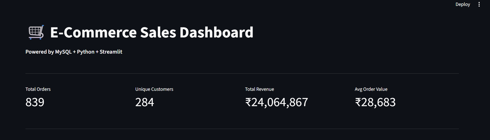
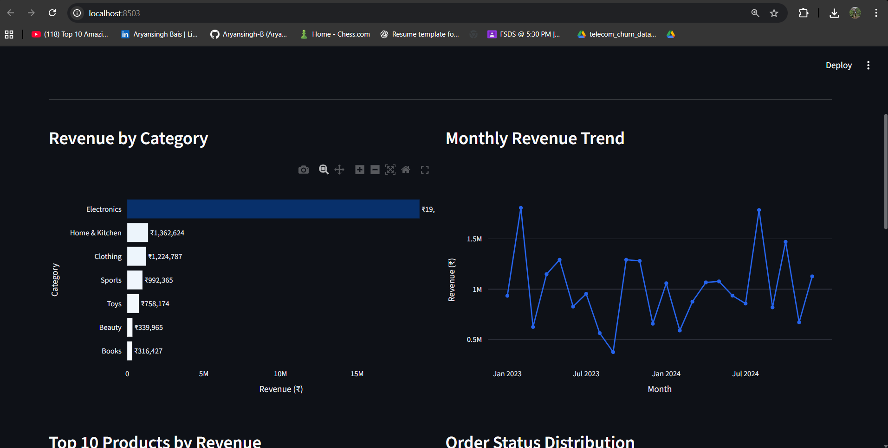
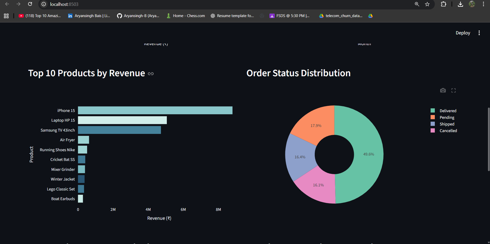
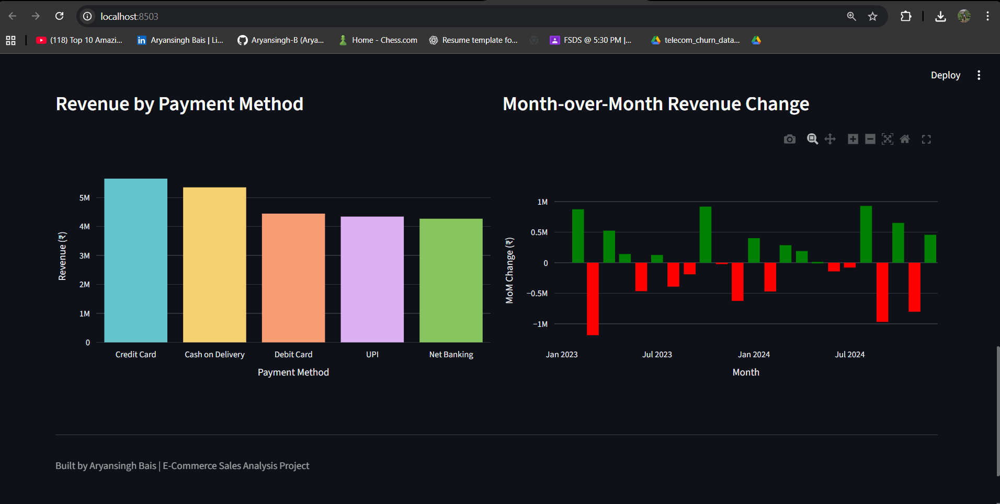

# 🛒 E-Commerce Sales Analysis Dashboard

An end-to-end data analytics project that transforms raw e-commerce data into actionable business insights using SQL, Python, and interactive dashboards.

---

## 🚀 Project Overview

This project simulates a real-world e-commerce analytics pipeline:

- 📊 Generate synthetic sales data using Python  
- 🗄️ Store and query data using MySQL  
- 📈 Analyze KPIs and business metrics  
- 📊 Build an interactive dashboard using Streamlit  

---

## 📊 Dashboard Preview

### 🔹 Main Dashboard


### 🔹 Payment Insights


### 🔹 Product & Orders Analysis


### 🔹 Revenue Trends


---

## 📈 Key Insights

- 💰 Generated ₹24M+ revenue from 800+ orders  
- 👥 Strong contribution from repeat customers  
- 📦 Electronics category dominates sales  
- 📊 Monthly revenue shows seasonal fluctuations  
- 💳 Credit Card & COD are most preferred payment methods  

---

## 🛠 Tech Stack

- **Database:** MySQL  
- **Backend:** Python (Pandas, Faker)  
- **Visualization:** Streamlit, Plotly  
- **ORM:** SQLAlchemy  

---

## ⚙️ Setup Instructions

## ⚙️ Setup Instructions

```bash
# Clone the repository
git clone https://github.com/<Aryansingh-B>/ecommerce-sales-analysis.git
cd ecommerce-sales-analysis

# Create virtual environment
python -m venv venv

# Activate virtual environment
# Windows
venv\Scripts\activate
# Mac/Linux
source venv/bin/activate

# Install dependencies
pip install -r requirements.txt
```

### Configure Environment Variables
Create a `.env` file in the root directory and add:

```bash
DB_HOST=localhost
DB_USER=root
DB_PASSWORD=yourpassword
DB_NAME=ecommerce
```

### Run the Project

```bash
# Generate data and load into database
python generate_data.py

# Run Streamlit dashboard
streamlit run dashboard.py
```

---

## 📁 Project Structure

```
ecommerce-sales-analysis/
│
├── screenshots/          # Dashboard images
├── dashboard.py          # Streamlit app
├── generate_data.py      # Data generation script
├── queries.sql           # SQL queries
├── requirements.txt      # Dependencies
├── .env                  # Environment variables
└── README.md
```

---

## 🎯 Skills Demonstrated

- SQL (JOINs, CTEs, Window Functions)
- Data Analysis & KPI Design
- Data Visualization
- End-to-End Project Development
- Dashboard Building with Streamlit
- Database Integration using SQLAlchemy

---

## 💡 Future Improvements

- 🌐 Deploy dashboard on Streamlit Cloud
- 📊 Add real-world dataset integration
- 📈 Implement time-series forecasting
- 🔐 Add user authentication for dashboard
- ⚡ Optimize queries for performance

---

## 👤 Author

**Aryansingh Bais**  
Aspiring Data Scientist | ML Enthusiast

- 🔗 GitHub: https://github.com/Aryansingh-B
- 🔗 LinkedIn: https://linkedin.com/in/aryansinghbais8